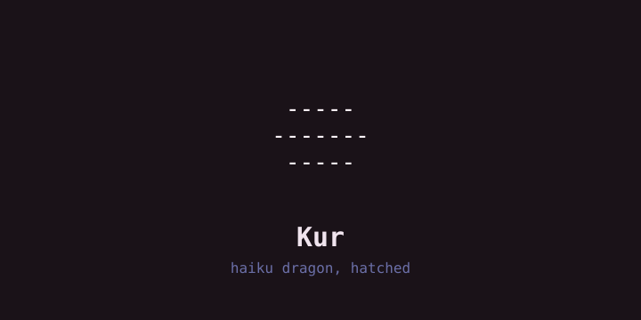
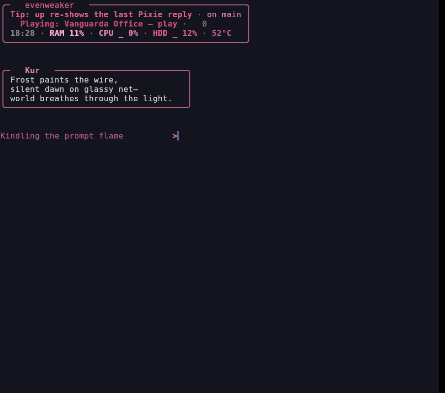

# Kur — haiku dragon, hatched

Small local haiku/voice familiar. Answers only in three lines. Local mind
via menagerie, voice of his own where piper + model exist.

## Wake

```bash
git clone git@github.com:ElegantVW/kur.git ~/kur
cd ~/kur && ./install.sh
systemctl --user enable --now kur-server   # the pen on :8083
menagerie ensure kur                        # his model on :8081
kur "autumn rain on the terminal"
```

First true-name speech hatches the egg (`faeOS` Scroll flips its sealed
leaf to his page). The quest stays a quest — no solve paths ship here.

## Truth

- Voice (:8083, `kur-server`) and mind (:8081, menagerie profile) are
  separate daemons. Either asleep ⇒ the quiet pen sleeps.
- Spoken voice needs `piper` + onnx model; without them he is text-only
  (this box included — the footage is text haiku).
- Secrets: none. Loopback only.

## Look



```
 -----
-------
 -----
```

## License

MIT — see [LICENSE](LICENSE).
